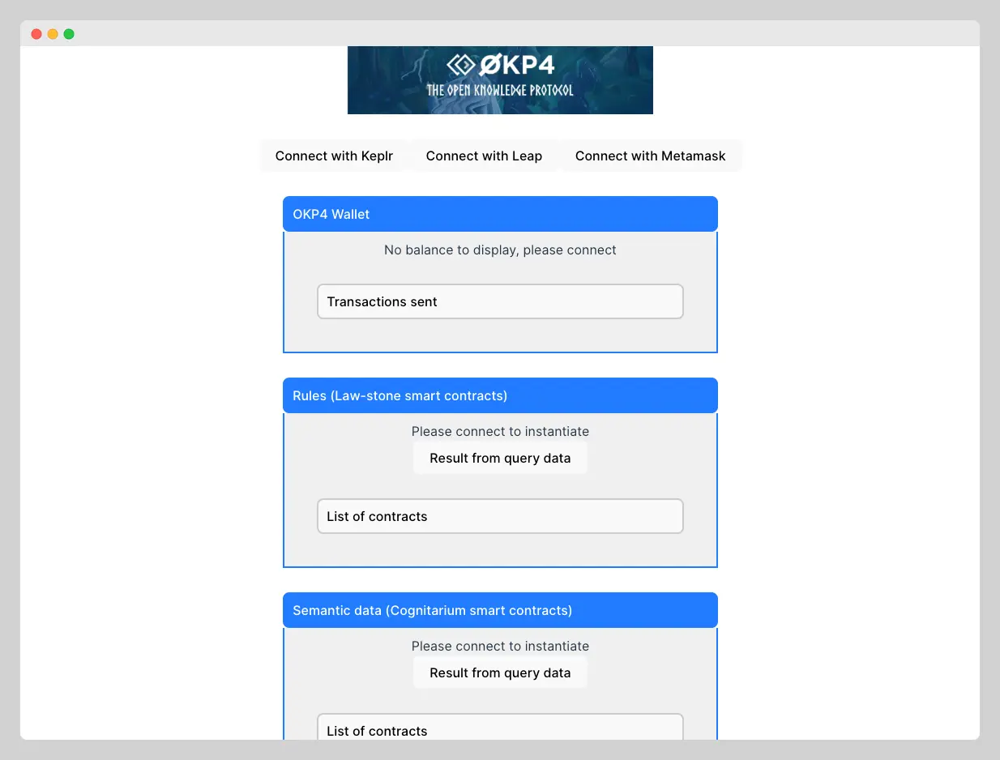

# OKP4 Boilerplate with React + TypeScript + Vite

> Boilerplate to craft UIs that interact with the [@okp4](https://okp4.network) protocol. Refer to the [tutorial for guidance on creating such interfaces](./TUTORIAL.md).

[](https://github.com/okp4/template-oss/actions/workflows/lint.yml)
[](https://conventionalcommits.org)
[](https://github.com/okp4/.github/blob/main/CODE_OF_CONDUCT.md)
[](https://opensource.org/licenses/BSD-3-Clause)

Front-end boilerplate to rapidly develop UIs for interacting with the OKP4 blockchain. Utilizing Vite, it shows how to handle the connection, the interaction with smart contracts, and the decoding of transactions.



---

## 🌟 Features

- Pre-configured setup to connect to OKP4 testnet
- Utility functions and [Graz](https://graz.sh/docs/) hooks to call, deploy, and interact with [OKP4 smart contracts](https://github.com/okp4/contracts)
- Decode transactions to analyze onchain Prolog programs and more

## 🛠 Prerequisites

- Node.js = 18.x

## 🖥 Get started

### Development

To set up and run the project locally, follow the following steps:

```bash
npm i
npm run dev
```

### Deployment

Build and serve the `dist` folder:

```bash
npm i
npm run build
```

To deploy your Vite.js site on decentralized, open technologies that prioritize user control, consider transitioning to Web3 by [hosting on Fleek.co](https://mirror.xyz/joshcstein.eth/UbInedh4ToAAfsDklzSPb3R1_hVSHIdE97hvxIWYlOo) (using the `node:18` Docker Image Name). This not only allows you to set a custom domain name but also benefits from IPFS's censorship-resistant P2P hosting and ENS domain linking.

## 🆘 Support

For bugs 🐛, feature requests 🌈, or other queries ❓, open an issue in the GitHub repository.

## You want to get involved? 😍

Please check out OKP4 health files :

- [Contributing](https://github.com/okp4/.github/blob/main/CONTRIBUTING.md)
- [Code of conduct](https://github.com/okp4/.github/blob/main/CODE_OF_CONDUCT.md)
