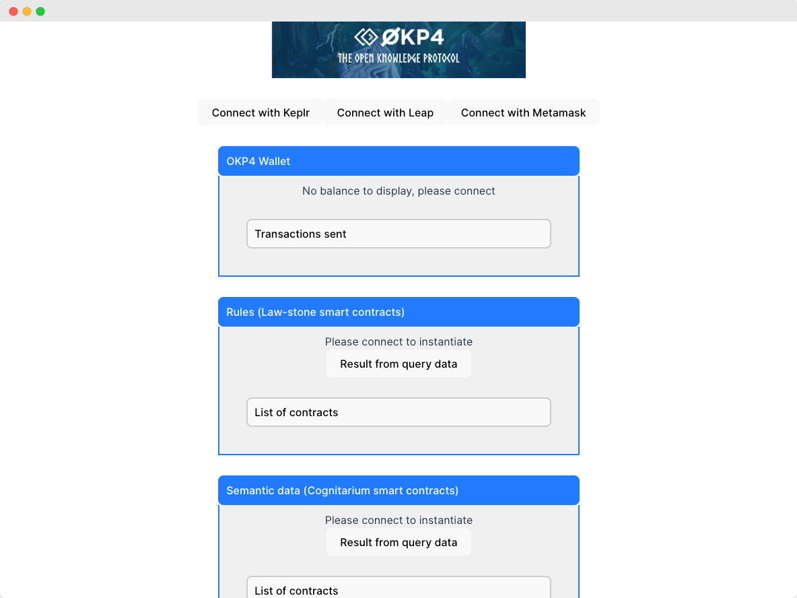

# OKP4 Boilerplate with React + TypeScript + Vite

Front-end boilerplate to rapidly develop UIs for interacting with the OKP4 blockchain. Utilizing Vite, it shows how to handle the connection, the interaction with smart contracts, and the decoding of transactions.



---

## 🌟 Features

- Pre-configured setup to connect to OKP4 testnet
- Utility functions and [Graz](https://graz.sh/docs/) hooks to call, deploy, and interact with [OKP4 smart contracts](https://github.com/okp4/contracts)
- Decode transactions to analyze onchain Prolog programs and more

## 🛠 Prerequisites

- Node.js >=18.x

## 🖥 Get started

To set up and run the project locally, follow the following steps:

```bash
npm i
npm run dev
```

## 🆘 Support

For bugs 🐛, feature requests 🌈, or other queries ❓, open an issue in the GitHub repository.

## 📜 License

This project is licensed under the BSD-3-Clause License. See LICENSE file for more details.
